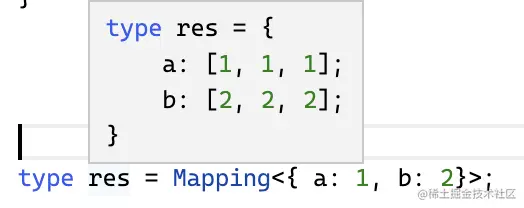
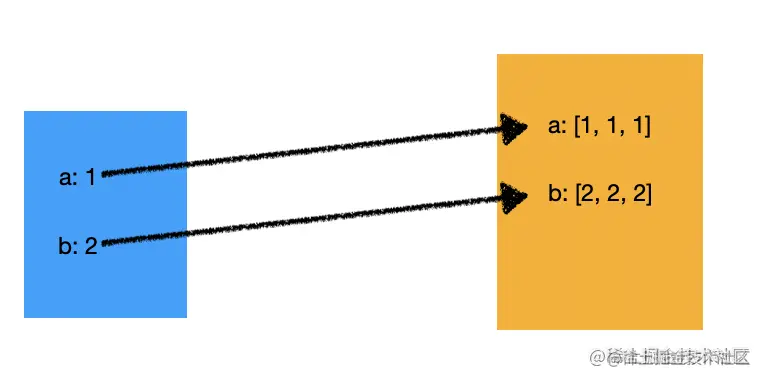
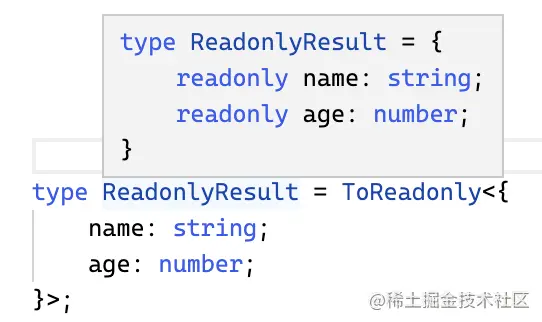
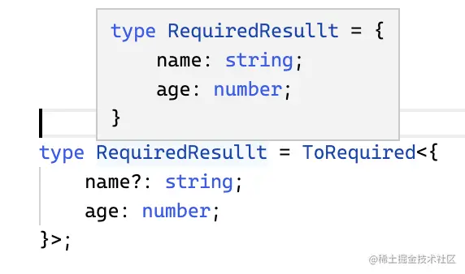

# 6 套路二：重新构造做变换
类型编程主要的目的就是对类型做各种转换，那么如何对类型做修改呢？

TypeScript 类型系统支持 3 种可以声明任意类型的变量： type、infer、类型参数。

type 叫做类型别名，其实就是声明一个变量存储某个类型：

```Plain Text
type ttt = Promise<number>;

```
infer 用于类型的提取，然后存到一个变量里，相当于局部变量：

```Plain Text
type GetValueType<P> = P extends Promise<infer Value> ? Value : never;

```
类型参数用于接受具体的类型，在类型运算中也相当于局部变量：

```Plain Text
type isTwo<T> = T extends 2 ? true: false;

```
但是，严格来说这三种也都不叫变量，因为它们不能被重新赋值。

TypeScript 设计可以做类型编程的类型系统的目的就是为了产生各种复杂的类型，那不能修改怎么产生新类型呢？

答案是重新构造。

这就涉及到了第二个类型体操套路：重新构造做变换。

## 重新构造
**TypeScript 的 type、infer、类型参数声明的变量都不能修改，想对类型做各种变换产生新的类型就需要重新构造。**

数组、字符串、函数等类型的重新构造比较简单。

索引类型，也就是多个元素的聚合类型的重新构造复杂一些，涉及到了映射类型的语法。

我们先从简单的开始：

## 数组类型的重新构造
### Push
有这样一个元组类型：

```Plain Text
type tuple = [1,2,3];

```
我想给这个元组类型再添加一些类型，怎么做呢？

TypeScript 类型变量不支持修改，我们可以构造一个新的元组类型：

```Plain Text
type Push<Arr extends  unknown[], Ele> = [...Arr, Ele];

```
类型参数 Arr 是要修改的数组/元组类型，元素的类型任意，也就是 unknown。

类型参数 Ele 是添加的元素的类型。

返回的是用 Arr 已有的元素加上 Ele 构造的新的元组类型。


[试一下](https://link.juejin.cn/?target=https%3A%2F%2Fwww.typescriptlang.org%2Fplay%3F%23code%2FC4TwDgpgBACgrgZwBYB4CCAnDUIA9gQB2AJglFHIQNaED2A7oQNoC6ANFAKIA2EAfFAC8UJgDpxmDBx4QWAbgBQS0JFiIkAJQgI43YELXIUTAIwcATBwDM7KABY%2BioA "https://www.typescriptlang.org/play?#code/C4TwDgpgBACgrgZwBYB4CCAnDUIA9gQB2AJglFHIQNaED2A7oQNoC6ANFAKIA2EAfFAC8UJgDpxmDBx4QWAbgBQS0JFiIkAJQgI43YELXIUTAIwcATBwDM7KABY+ioA")

这就是数组/元组的重新构造。

> **数组和元组的区别**：数组类型是指任意多个同一类型的元素构成的，比如 number\[\]、Array，而元组则是数量固定，类型可以不同的元素构成的，比如 \[1, true, 'guang'\]。

### Unshift
可以在后面添加，同样也可以在前面添加：

```Plain Text
type Unshift<Arr extends  unknown[], Ele> = [Ele, ...Arr];

```


[试一下](https://link.juejin.cn/?target=https%3A%2F%2Fwww.typescriptlang.org%2Fplay%3F%23code%2FC4TwDgpgBAqgdgZwBYEsBmwA8BBATrqCAD2AjgBMEooBXOAazgHsB3OAbQF0AaKAUQA2EAHxQAvFHaCIvAHTy8uTgG4AUKtCRYiVBgBKEBDQHBx25OizsAjLwBMvAMw8oABmHKgA "https://www.typescriptlang.org/play?#code/C4TwDgpgBAqgdgZwBYEsBmwA8BBATrqCAD2AjgBMEooBXOAazgHsB3OAbQF0AaKAUQA2EAHxQAvFHaCIvAHTy8uTgG4AUKtCRYiVBgBKEBDQHBx25OizsAjLwBMvAMw8oABmHKgA")

这两个案例比较简单，我们来做一个复杂的：

### Zip
有这样两个元组：

```Plain Text
type tuple1 = [1,2];
type tuple2 = ['guang', 'dong'];

```
我们想把它们合并成这样的元组：

```Plain Text
type tuple = [[1, 'guang'], [2, 'dong']];

```
思路很容易想到，提取元组中的两个元素，构造成新的元组：

```Plain Text
type Zip<One extends [unknown, unknown], Other extends [unknown, unknown]> = 
    One extends [infer OneFirst, infer OneSecond]
        ? Other extends [infer OtherFirst, infer OtherSecond]
            ? [[OneFirst, OtherFirst], [OneSecond, OtherSecond]] :[] 
                : [];

```
两个类型参数 One、Other 是两个元组，类型是 \[unknown, unknown\]，代表 2 个任意类型的元素构成的元组。

通过 infer 分别提取 One 和 Other 的元素到 infer 声明的局部变量 OneFirst、OneSecond、OtherFirst、OtherSecond 里。

用提取的元素构造成新的元组返回即可：


[试一下](https://link.juejin.cn/?target=https%3A%2F%2Fwww.typescriptlang.org%2Fplay%3F%23code%2FC4TwDgpgBAWglmAPAeQHbQgD2BVATAZygG0BXVAa1QHsB3VAGinKrtQF0nlgALCAJyhYc%2BImUo16TFpI4A%2BKAF4oAKCjqoaDNlyEScVADMBm9ADE4-AsCYHjgrQGUIAY2r52ajd4D8m3ibCumJ2Jtx8-BZWNlChDgH8zm4eXt5pUH7ExFpR1lwJucCcJE6u7nj5EUnl7OxQAFzEdanprfUk7ADcKi2taSqgkLAIAEoQBKQANsBKw0jEAIwMAEzFxADkAOakAIaom%2BtM63juB%2BxynUA "https://www.typescriptlang.org/play?#code/C4TwDgpgBAWglmAPAeQHbQgD2BVATAZygG0BXVAa1QHsB3VAGinKrtQF0nlgALCAJyhYc+ImUo16TFpI4A+KAF4oAKCjqoaDNlyEScVADMBm9ADE4-AsCYHjgrQGUIAY2r52ajd4D8m3ibCumJ2Jtx8-BZWNlChDgH8zm4eXt5pUH7ExFpR1lwJucCcJE6u7nj5EUnl7OxQAFzEdanprfUk7ADcKi2taSqgkLAIAEoQBKQANsBKw0jEAIwMAEzFxADkAOakAIaom+tM63juB+xynUA")

但是这样只能合并两个元素的元组，如果是任意个呢？

那就得用递归了：

```Plain Text
type Zip2<One extends unknown[], Other extends unknown[]> = 
    One extends [infer OneFirst, ...infer OneRest]
        ? Other extends [infer OtherFirst, ...infer OtherRest]
            ? [[OneFirst, OtherFirst], ...Zip2<OneRest, OtherRest>]: []
                : [];

```
类型参数 One、Other 声明为 unknown\[\]，也就是元素个数任意，类型任意的数组。

每次提取 One 和 Other 的第一个元素 OneFirst、OtherFirst，剩余的放到 OneRest、OtherRest 里。

用 OneFirst、OtherFirst 构造成新的元组的一个元素，剩余元素继续递归处理 OneRest、OtherRest。

这样，就能处理任意个数元组的合并：


[试一下](https://link.juejin.cn/?target=https%3A%2F%2Fwww.typescriptlang.org%2Fplay%3F%23code%2FC4TwDgpgBAWglmATAHgPIDtoQB7AugEwGcoBXdAa3QHsB3dAbQF0AaKVYACwgCcoc8hEuSp1GTAHxQAvFABQURe0z9c%2BYlAZx0AM17KIAMTg8iwNgDor2vXwwQAShDNMFS9wH52XfQPUktXX0Obh5jU3MoKwsbYJ8eJxc3dxSoLwYGe3CzNhDebOBWKKt4JDRMRMi8hOdgCSYALk1XVNalJuYAbjkeuVBIWARERNIAG2AZQbKGAEYWRBYAZhYAFhYAViKGAHIAc1IAQ3Rd7bZtgmpj06htuCJr7YAjWoedHjh1bclOoA "https://www.typescriptlang.org/play?#code/C4TwDgpgBAWglmATAHgPIDtoQB7AugEwGcoBXdAa3QHsB3dAbQF0AaKVYACwgCcoc8hEuSp1GTAHxQAvFABQURe0z9c+YlAZx0AM17KIAMTg8iwNgDor2vXwwQAShDNMFS9wH52XfQPUktXX0Obh5jU3MoKwsbYJ8eJxc3dxSoLwYGe3CzNhDebOBWKKt4JDRMRMi8hOdgCSYALk1XVNalJuYAbjkeuVBIWARERNIAG2AZQbKGAEYWRBYAZhYAFhYAViKGAHIAc1IAQ3Rd7bZtgmpj06htuCJr7YAjWoedHjh1bclOoA")

了解了数组类型的重新构造，我们再来看下字符串类型的：

## 字符串类型的重新构造
### CapitalizeStr
我们想把一个字符串字面量类型的 'guang' 转为首字母大写的 'Guang'。

需要用到字符串类型的提取和重新构造：

```Plain Text
type CapitalizeStr<Str extends string> = 
    Str extends `${infer First}${infer Rest}` 
        ? `${Uppercase<First>}${Rest}` : Str;

```
我们声明了类型参数 Str 是要处理的字符串类型，通过 extends 约束为 string。

通过 infer 提取出首个字符到局部变量 First，提取后面的字符到局部变量 Rest。

然后使用 TypeScript 提供的内置高级类型 Uppercase 把首字母转为大写，加上 Rest，构造成新的字符串类型返回。


[试一下](https://link.juejin.cn/?target=https%3A%2F%2Fwww.typescriptlang.org%2Fplay%3F%23code%2FC4TwDgpgBAwghmAlsOAbRAvCBlYAnAHlzyggA9gIA7AEwGco79EqBzAPigF4pjSLq9KAAMAJAG8WAMwgkAYojxMAvhOmyoAJQgrhUAPwiJAVTCQ8AYzh0IBBUuDtV47bqgAuXvgDcAKH%2BgkLAIyGiYEK4ArqjA3MFIKOhYxAQA5KyRcGyp7N5AA "https://www.typescriptlang.org/play?#code/C4TwDgpgBAwghmAlsOAbRAvCBlYAnAHlzyggA9gIA7AEwGco79EqBzAPigF4pjSLq9KAAMAJAG8WAMwgkAYojxMAvhOmyoAJQgrhUAPwiJAVTCQ8AYzh0IBBUuDtV47bqgAuXvgDcAKH+gkLAIyGiYEK4ArqjA3MFIKOhYxAQA5KyRcGyp7N5AA")

这就是字符串类型的重新构造：**从已有的字符串类型中提取出一些部分字符串，经过一系列变换，构造成新的字符串类型。**

### CamelCase
我们再来实现 dong\_dong\_dong 到 dongDongDong 的变换。

同样是提取和重新构造：

```Plain Text
type CamelCase<Str extends string> = 
    Str extends `${infer Left}_${infer Right}${infer Rest}`
        ? `${Left}${Uppercase<Right>}${CamelCase<Rest>}`
        : Str;

```
类型参数 Str 是待处理的字符串类型，约束为 string。

提取 \_ 之前和之后的两个字符到 infer 声明的局部变量 Left 和 Right，剩下的字符放到 Rest 里。

然后把右边的字符 Right 大写，和 Left 构造成新的字符串，剩余的字符 Rest 要继续递归的处理。

这样就完成了从下划线到驼峰形式的转换：


[试一下](https://link.juejin.cn/?target=https%3A%2F%2Fwww.typescriptlang.org%2Fplay%3F%23code%2FC4TwDgpgBAwghgWwgG3gZwgHgMrAE5QQAewEAdgCZpRr4CWZA5gHxQC8UAUFD1LgcVKVqAAwAkAbwYAzCAQAyEacAC%2BAfUky5UAEp1GAC1Waysgjoi0VI7rzsB%2BKOImLlKyQFUwkPAGM4GJh6hsDM7hLwSKgBWBa0YTZ2dgBcfPgA3JycoJCwiCjoEHEArsjA7HlRhZgA5BQA9kxqDU0tjDXM6UA "https://www.typescriptlang.org/play?#code/C4TwDgpgBAwghgWwgG3gZwgHgMrAE5QQAewEAdgCZpRr4CWZA5gHxQC8UAUFD1LgcVKVqAAwAkAbwYAzCAQAyEacAC+AfUky5UAEp1GAC1Waysgjoi0VI7rzsB+KOImLlKyQFUwkPAGM4GJh6hsDM7hLwSKgBWBa0YTZ2dgBcfPgA3JycoJCwiCjoEHEArsjA7HlRhZgA5BQA9kxqDU0tjDXM6UA")

### DropSubStr
可以修改自然也可以删除，我们再来做一个删除一段字符串的案例：删除字符串中的某个子串

```Plain Text
type DropSubStr<Str extends string, SubStr extends string> = 
    Str extends `${infer Prefix}${SubStr}${infer Suffix}` 
        ? DropSubStr<`${Prefix}${Suffix}`, SubStr> : Str;

```
类型参数 Str 是待处理的字符串， SubStr 是要删除的字符串，都通过 extends 约束为 string 类型。

通过模式匹配提取 SubStr 之前和之后的字符串到 infer 声明的局部变量 Prefix、Suffix 中。

如果不匹配就直接返回 Str。

如果匹配，那就用 Prefix、Suffix 构造成新的字符串，然后继续递归删除 SubStr。直到不再匹配，也就是没有 SubStr 了。


[试一下](https://link.juejin.cn/?target=https%3A%2F%2Fwww.typescriptlang.org%2Fplay%3F%23code%2FC4TwDgpgBAIgTgezAZQK4CNnDgHi3KCAD2AgDsATAZyiuwEsyBzAGijU20JPOtoeYA%2BKAF4oAKChT2XYqUo0ABgBIA3owBmEAgAU4EDfSIBfNR3yn1ZLQTQbDJxROkuoAfliIUGfDhWq9AyNLOwdjRTZzbGEALhk4AG5xcVBITyQAJQgqVAAbYFF0705cAHIKBGYAPxrStlKq0sEEoA "https://www.typescriptlang.org/play?#code/C4TwDgpgBAIgTgezAZQK4CNnDgHi3KCAD2AgDsATAZyiuwEsyBzAGijU20JPOtoeYA+KAF4oAKChT2XYqUo0ABgBIA3owBmEAgAU4EDfSIBfNR3yn1ZLQTQbDJxROkuoAfliIUGfDhWq9AyNLOwdjRTZzbGEALhk4AG5xcVBITyQAJQgqVAAbYFF0705cAHIKBGYAPxrStlKq0sEEoA")

字符串类型的重新构造之后，我们再来看下函数类型的重新构造：

## 函数类型的重新构造：
### AppendArgument
之前我们分别实现了参数和返回值的提取，那么重新构造就是用这些提取出的类型做下修改，构造一个新的类型即可。

比如在已有的函数类型上添加一个参数：

```Plain Text
type AppendArgument<Func extends Function, Arg> = 
    Func extends (...args: infer Args) => infer ReturnType 
        ? (...args: [...Args, Arg]) => ReturnType : never;

```
类型参数 Func 是待处理的函数类型，通过 extends 约束为 Function，Arg 是要添加的参数类型。

通过模式匹配提取参数到 infer 声明的局部变量 Args 中，提取返回值到局部变量 ReturnType 中。

用 Args 数组添加 Arg 构造成新的参数类型，结合 ReturnType 构造成新的函数类型返回。

这样就完成了函数类型的修改：


[试一下](https://link.juejin.cn/?target=https%3A%2F%2Fwww.typescriptlang.org%2Fplay%3F%23code%2FC4TwDgpgBAgmkDsAmMBOBzArgWwg4APAGKYIDGUEAHsHkgM5QnnACWA9ggDSwYB8UALxQAUFHFNSFarWSMAFADplAQwz0AXFFYIAZhFS909AJRCBO-YYBKEYJlQIAKuGhiJHgPxQlq9VoBtZUU0Yx5QgF0zQQFbe0cXSCgtBAgANwMAbhERUCS4RBQMHDxgW3pMABtgcWECulCS-AJ5BBVcLXpgVB10aIEAI3Z2SogVbigEHAGDPmygA "https://www.typescriptlang.org/play?#code/C4TwDgpgBAgmkDsAmMBOBzArgWwg4APAGKYIDGUEAHsHkgM5QnnACWA9ggDSwYB8UALxQAUFHFNSFarWSMAFADplAQwz0AXFFYIAZhFS909AJRCBO-YYBKEYJlQIAKuGhiJHgPxQlq9VoBtZUU0Yx5QgF0zQQFbe0cXSCgtBAgANwMAbhERUCS4RBQMHDxgW3pMABtgcWECulCS-AJ5BBVcLXpgVB10aIEAI3Z2SogVbigEHAGDPmygA")

最后，我们再来看下索引类型的重新构造

## 索引类型的重新构造
索引类型是聚合多个元素的类型，class、对象等都是索引类型，比如这就是一个索引类型：

```Plain Text
type obj = {
  name: string;
  age: number;
  gender: boolean;
}

```
索引类型可以添加修饰符 readonly（只读）、?（可选）:

```Plain Text
type obj = {
  readonly name: string;
  age?: number;
  gender: boolean;
}

```
对它的修改和构造新类型涉及到了映射类型的语法：

```Plain Text
type Mapping<Obj extends object> = { 
    [Key in keyof Obj]: Obj[Key]
}

```
### Mapping
映射的过程中可以对 value 做下修改，比如：

```Plain Text
type Mapping<Obj extends object> = { 
    [Key in keyof Obj]: [Obj[Key], Obj[Key], Obj[Key]]
}

```
类型参数 Obj 是待处理的索引类型，通过 extends 约束为 object。

用 keyof 取出 Obj 的索引，作为新的索引类型的索引，也就是 Key in keyof Obj。

值的类型可以做变换，这里我们用之前索引类型的值 Obj\[Key\] 构造成了三个元素的元组类型 \[Obj\[Key\], Obj\[Key\], Obj\[Key\]\]：



[试一下](https://link.juejin.cn/?target=https%3A%2F%2Fwww.typescriptlang.org%2Fplay%3F%23code%2FFAFwngDgpgBAsgQwhAlgOwOYB4DyAjAKxigA8Qo0ATAZxgHtCoBjEAPhgF4YBvGYGATADaAaShgY6GAGtxdAGYx8BALoAuYctHiVAGiWFtYPQYJGVK4AF9goSLABOUWl0TJ02Xgg0BGfXg0AJitWAG4gA "https://www.typescriptlang.org/play?#code/FAFwngDgpgBAsgQwhAlgOwOYB4DyAjAKxigA8Qo0ATAZxgHtCoBjEAPhgF4YBvGYGATADaAaShgY6GAGtxdAGYx8BALoAuYctHiVAGiWFtYPQYJGVK4AF9goSLABOUWl0TJ02Xgg0BGfXg0AJitWAG4gA")

索引类型的映射画下图很容易理解：



### UppercaseKey
除了可以对 Value 做修改，也可以对 Key 做修改，使用 as，这叫做`重映射`：

比如把索引类型的 Key 变为大写。

```Plain Text
type UppercaseKey<Obj extends object> = { 
    [Key in keyof Obj as Uppercase<Key & string>]: Obj[Key]
}

```
类型参数 Obj 是待处理的索引类型，通过 extends 约束为 object。

新的索引类型的索引为 Obj 中的索引，也就是 Key in keyof Obj，但要做一些变换，也就是 as 之后的。

通过 Uppercase 把索引 Key 转为大写，因为索引可能为 string、number、symbol 类型，而这里只能接受 string 类型，所以要 & string，也就是取索引中 string 的部分。

value 保持不变，也就是之前的索引 Key 对应的值的类型 Obj\[Key\]。

这样构造出的新的索引类型，就把原来索引类型的索引转为了大写：


[试一下](https://link.juejin.cn/?target=https%3A%2F%2Fwww.typescriptlang.org%2Fplay%3F%23code%2FC4TwDgpgBAqmkCcDGBDAzhA0hEAeA8gEYBWUEAHsBAHYAmaUA9iREsAHxQC8UA3lACgowqAG1sIKAEtqUANY5GAMyhFS6WPAjJ0EXBKgAyKGmAIZAc3YBdAFyqS4nNYEBfAQNCRNiVBgkAShBoAK4ANsDcPtp%2BWDi4-BYhKNQW9gCMADRQtIyp9gBMruwA3EA "https://www.typescriptlang.org/play?#code/C4TwDgpgBAqmkCcDGBDAzhA0hEAeA8gEYBWUEAHsBAHYAmaUA9iREsAHxQC8UA3lACgowqAG1sIKAEtqUANY5GAMyhFS6WPAjJ0EXBKgAyKGmAIZAc3YBdAFyqS4nNYEBfAQNCRNiVBgkAShBoAK4ANsDcPtp+WDi4-BYhKNQW9gCMADRQtIyp9gBMruwA3EA")

#### Record
TypeScript 提供了内置的高级类型 Record 来创建索引类型：

```Plain Text
type Record<K extends string | number | symbol, T> = { [P in K]: T; }

```
指定索引和值的类型分别为 K 和 T，就可以创建一个对应的索引类型。

上面的索引类型的约束我们用的 object，其实更语义化一点我推荐用 Record<string, any>：

```Plain Text
type UppercaseKey<Obj extends Record<string, any>> = { 
    [Key in keyof Obj as Uppercase<Key & string>]: Obj[Key]
}

```
也就是约束类型参数 Obj 为 key 为 string，值为任意类型的索引类型。

### ToReadonly
索引类型的索引可以添加 readonly 的修饰符，代表只读。

那我们就可以实现给索引类型添加 readonly 修饰的高级类型：

```Plain Text
type ToReadonly<T> =  {
    readonly [Key in keyof T]: T[Key];
}

```
通过映射类型构造了新的索引类型，给索引加上了 readonly 的修饰，其余的保持不变，索引依然为原来的索引 Key in keyof T，值依然为原来的值 T\[Key\]。



[试一下](https://link.juejin.cn/?target=https%3A%2F%2Fwww.typescriptlang.org%2Fplay%3F%23code%2FFAFwngDgpgBAKgewEpQIYBMEDsA2YA8cAfDALwwwDewFFATmprmDANoDSULAlljANZcEAM3gBdAFzwOXMQG5gAX2Arw0GCgzY8KAM4BXHCDLxkjbQWq0YWVAFsoU3SDq8A5guuo3jm-rsARlB0CopEckA "https://www.typescriptlang.org/play?#code/FAFwngDgpgBAKgewEpQIYBMEDsA2YA8cAfDALwwwDewFFATmprmDANoDSULAlljANZcEAM3gBdAFzwOXMQG5gAX2Arw0GCgzY8KAM4BXHCDLxkjbQWq0YWVAFsoU3SDq8A5guuo3jm-rsARlB0CopEckA")

### ToPartial
同理，索引类型还可以添加可选修饰符：

```Plain Text
type ToPartial<T> = {
    [Key in keyof T]?: T[Key]
}

```
给索引类型 T 的索引添加了 ? 可选修饰符，其余保持不变。


[试一下](https://link.juejin.cn/?target=https%3A%2F%2Fwww.typescriptlang.org%2Fplay%3F%23code%2FC4TwDgpgBAKg9gBQIYCdgEskBsA8MB8UAvFAN4BQUVUA2gNIQhToB2UA1o3AGawC6AfgBcseoz7kAvuXKhIUZGkxYAShADOAVyzBisRKgzYcFalBZIAthBHrgKVgHMA3JWpJHN85ssAjCCiukvjOQA "https://www.typescriptlang.org/play?#code/C4TwDgpgBAKg9gBQIYCdgEskBsA8MB8UAvFAN4BQUVUA2gNIQhToB2UA1o3AGawC6AfgBcseoz7kAvuXKhIUZGkxYAShADOAVyzBisRKgzYcFalBZIAthBHrgKVgHMA3JWpJHN85ssAjCCiukvjOQA")

### ToMutable
可以添加 readonly 修饰，当然也可以去掉：

```Plain Text
type ToMutable<T> = {
    -readonly [Key in keyof T]: T[Key]
}

```
给索引类型 T 的每个索引去掉 readonly 的修饰，其余保持不变。


[试一下](https://link.juejin.cn/?target=https%3A%2F%2Fwww.typescriptlang.org%2Fplay%3F%23code%2FC4TwDgpgBAKg9gWQK7AIYCMA2EA8MB8UAvFAN4BQUVUAtAE4SoAmcAdpiFANoDSEnAS1ZQA1vzgAzWAF0AXLF79p5AL7lyoSFGRosEAEoQAzkkzBiVeDozYcFalAbM2HKK1QBbCPKPA6QgHMAbkpqVADvNyQPdAg6EJV8EKA "https://www.typescriptlang.org/play?#code/C4TwDgpgBAKg9gWQK7AIYCMA2EA8MB8UAvFAN4BQUVUAtAE4SoAmcAdpiFANoDSEnAS1ZQA1vzgAzWAF0AXLF79p5AL7lyoSFGRosEAEoQAzkkzBiVeDozYcFalAbM2HKK1QBbCPKPA6QgHMAbkpqVADvNyQPdAg6EJV8EKA")

### ToRequired
同理，也可以去掉可选修饰符：

```Plain Text
type ToRequired<T> = {
    [Key in keyof T]-?: T[Key]
}

```
给索引类型 T 的索引去掉 ? 的修饰 ，其余保持不变。



[试一下](https://link.juejin.cn/?target=https%3A%2F%2Fwww.typescriptlang.org%2Fplay%3F%23code%2FC4TwDgpgBAKg9gJQgRwK4EsBOEAmAeGAPigF4oBvAKChqgG0BpCEKdAOygGtm4AzWALoBaAPwAuWI2YDKAX0qVQkKEjRZcSAM6oANjuClYiFBmz4qtKGwCGAWwjiom4JnYBzANzVa1txAlsqLYARhCYXrKEXkA "https://www.typescriptlang.org/play?#code/C4TwDgpgBAKg9gJQgRwK4EsBOEAmAeGAPigF4oBvAKChqgG0BpCEKdAOygGtm4AzWALoBaAPwAuWI2YDKAX0qVQkKEjRZcSAM6oANjuClYiFBmz4qtKGwCGAWwjiom4JnYBzANzVa1txAlsqLYARhCYXrKEXkA")

### FilterByValueType
可以在构造新索引类型的时候根据值的类型做下过滤：

```Plain Text
type FilterByValueType<
    Obj extends Record<string, any>, 
    ValueType
> = {
    [Key in keyof Obj 
        as Obj[Key] extends ValueType ? Key : never]
        : Obj[Key]
}

```
类型参数 Obj 为要处理的索引类型，通过 extends 约束为索引为 string，值为任意类型的索引类型 Record<string, any>。

类型参数 ValueType 为要过滤出的值的类型。

构造新的索引类型，索引为 Obj 的索引，也就是 Key in keyof Obj，但要做一些变换，也就是 as 之后的部分。

如果原来索引的值 Obj\[Key\] 是 ValueType 类型，索引依然为之前的索引 Key，否则索引设置为 never，never 的索引会在生成新的索引类型时被去掉。

值保持不变，依然为原来索引的值，也就是 Obj\[Key\]。

这样就达到了过滤索引类型的索引，产生新的索引类型的目的：


[试一下](https://link.juejin.cn/?target=https%3A%2F%2Fwww.typescriptlang.org%2Fplay%3F%23code%2FC4TwDgpgBAYglgG2BATgIRANQIYIK4QAq4EAPAPIBGAVlBAB7IB2AJgM5QBKEAxgPYoWpNsBRwmAcwA0UbExAA%2BGTnxESCqAF4oAbwBQUQ1ADaAaQggo4qAGsLfAGZQqtA0ffYOLsxYC6dRghWDhUCYkgoAH4oc0sALigmCAA3VF83d0ME71j0gF89PXFkFAdsHmgABVQ2PiZdDMTsAFsIBJExSQBuRuwJNsS8ZspUHvcACz5KShB20XEJY18egsLQCPgkVG42PCQtWEQSjFC1SFJqlFqmGQ6FqAAfQeHUBS6gA "https://www.typescriptlang.org/play?#code/C4TwDgpgBAYglgG2BATgIRANQIYIK4QAq4EAPAPIBGAVlBAB7IB2AJgM5QBKEAxgPYoWpNsBRwmAcwA0UbExAA+GTnxESCqAF4oAbwBQUQ1ADaAaQggo4qAGsLfAGZQqtA0ffYOLsxYC6dRghWDhUCYkgoAH4oc0sALigmCAA3VF83d0ME71j0gF89PXFkFAdsHmgABVQ2PiZdDMTsAFsIBJExSQBuRuwJNsS8ZspUHvcACz5KShB20XEJY18egsLQCPgkVG42PCQtWEQSjFC1SFJqlFqmGQ6FqAAfQeHUBS6gA")

## 总结
TypeScript 支持 type、infer、类型参数来保存任意类型，相当于变量的作用。

但其实也不能叫变量，因为它们是不可变的。**想要变化就需要重新构造新的类型，并且可以在构造新类型的过程中对原类型做一些过滤和变换。**

数组、字符串、函数、索引类型等都可以用这种方式对原类型做变换产生新的类型。其中索引类型有专门的语法叫做映射类型，对索引做修改的 as 叫做重映射。

提取和构造这俩是相辅相成的，学完了`模式匹配做提取`，`重新构造做变换` 这两个套路之后，很多类型体操就有思路了。

[本文案例的合并](https://link.juejin.cn/?target=https%3A%2F%2Fwww.typescriptlang.org%2Fplay%3F%23code%2FPTAEgdTQRv0LH%2BChZKACgVwM4AtYBcCeAHAU2XQwB4BBAJytEIA9tCA7AEzVFBWYGtmB7AO7MA2gF0ANKACiAG0IA%2BUAF5QIgHSbqVKXMJiA3PDxESmAEqE0KWdhVnyIgIxSATFIDMk0ABYFRhDAAVWZMAEsAM2wcAmIQ8KjKGjpGFnZObj4hUW89JVURPSlNdW1DY1jQeIxI7EtrW3tq2rJnN09vAAZ-eEQALTD8GNMB-DIAeWZiBiY2DhFMgWEpRezvcewMQloZtPnV5a5eJeYxfNBYTk5J6dS5tTDmCO3QG4AxMKo0bClH59obgBlQgAY34bDElyu0IA-K9Ni9dvcRH8XhstlQPl8fqBUQCEVRgWCIVDoWTQHCRCJ3p9vlJ0dssd9vNSpkTwax6QT2RCxKAAFziC7kkVXflqcqk0Vk4bEUb1Gx2VSjVouVwsgDkAHMUABDZhajVSDWscGGs4BfqDVyy0CjVwTKYpWbpA45LkY517I5ZYTic5Sm5e5F415TJk4kqhm71bCQ0Vwhk7O7pFFPNEEiPFTTRgmx%2BPSziU1mELPwjER7wle2Owixj3bWMKMTi8RSwucVuSkxy60KxrK62qiTuDwSHwSACsmp1%2BsNxtNBqNoA1YTQy41ACMrNgNxEqGE0hqLb0wIB1bUAZN6AJjk4IFQABhXX4MLYXWyMIAL0IgOwVFtj%2BfV93y-H8qDIUDg3Sb4DwNc4IKRdIAAMABIAG9QwjABfNDQ1jTDEIpUAUNQoJ8CIKgQV1NBCDICMFGw1C8II8VQICHsHyfF830-OsrEVewAK44Dv1-MhtT1JcejvR8AFtCFkR9qP-XU5IUqiaPglMOGgx4tQDaFNJdDhiNDAAZQgokwgB9HD01ocwwi1DBsAY3Cd3w9srjhYjzMstDSPIyjqLIBynOwei0Nk%2BTFJopsPNFFjfzYyoorU6j%2ByVDjVJisTFy1Ky8oKs0NSkxAABEqH4fBARQTdQNtCqqpqurRMM70dINKRmra%2B4Or0%2BwpR6pDbP%2BZAqAssJ6AY7rf1cuzQBqiIIkm-DhRFOFGuq2rQLIYikHG5aprQxbDvwrrtt-JREqoZLTE2jL7E2mawJNM0AD8Po3N6SstMBAF-FcBT1ACgyLSagdTk5honYkGiDYcGUEh7BaO4EFII4N5UewMJwSkcH9KuTHmDRhCOAAChKXUqC1NBxVDcG0AAShUJQ3OwFAqGYAAVSpPKLUAKc0KmadbEoGbx6mxGZ5QlEsdnOZ50xxSmAA3bZbuIWGwepxGWDqPjGnsLX4Z1pGyDJ5gVMIcU%2BulpRN34fh5H1KRmER7cqFKsBACJfQBUfUAbx9AGj1IGAFkn2fA1bTDsjdImTcACt0dAfgE9BcL7FQtbOBEABpQhcFxZhQB4fP%2BAiV4E5bNRxgT3P8-WWu89wBv47r5vIUwipTHGjhVGjiOtTITPdXFFxQE3cVXEwr2qlBij1Kb20Au2ILCCbuPE9J5PU5BdPVEzqU28L4vS-LmvE6o2fAvUsgm9AAAyUA%2BubcVz7bjuu7iOfV6bh7VGX%2Be1F16Z1nAaUeUg8qT2nr9UAXN%2BCWF1IuWQuBbRwIQUg3AZAubnFAKhKU41EHgmQWoO%2BjwT64DLrAquXN35GE7radBRDcB-1gfAwghDmDIKHlKS2ckba-l0kYaEuotTW1AG7GSHs6EzzgUgKm2M3yoP4HIqgCjZBYPOHg6ER8yElwoeXLmYgYTihoU3D%2BtoVFqJYbI%2BRYQ3zcOhLwsRfUhFXBEWIiRUjYDQKBnAkOKBXybnkEo-xgT5AaIzlKAAtAQjBJD87Hz0ZQwxJj37eM-qAUJuogm8QaJlVhWSckOKuLEph4irb8JglqVxnB3HK3durbxMi2EAEcUCfEIKwJRlg2kdNYBE-eh9SFFySQYsQUTjGwLSfQ9iPT2njVYP2AcrC5l9OKZwJxkyXFSjqeIhpN0mkwI%2BLYbYAAhXAAA1N8KBCCK0ILaY5TAqDnKubIG5dyN5J0sGCKg-S%2BpSH1LgBQUhXnvNiJooZCTdGnwronPmoBL5vzMUnUFtzKhwjvsrQgasqAFnJK-Ru9d0mwEeE8iIuoQTECQNsNA4JcE8IqU-ARBoakItEfUyRjToQYBTpuXAlTdLiDoRkx5jYDaZVFc8y51y0VEDINSr4uMmVVNAAAHz2Zyz2BggA "https://www.typescriptlang.org/play?#code/PTAEgdTQRv0LH+ChZKACgVwM4AtYBcCeAHAU2XQwB4BBAJytEIA9tCA7AEzVFBWYGtmB7AO7MA2gF0ANKACiAG0IA+UAF5QIgHSbqVKXMJiA3PDxESmAEqE0KWdhVnyIgIxSATFIDMk0ABYFRhDAAVWZMAEsAM2wcAmIQ8KjKGjpGFnZObj4hUW89JVURPSlNdW1DY1jQeIxI7EtrW3tq2rJnN09vAAZ-eEQALTD8GNMB-DIAeWZiBiY2DhFMgWEpRezvcewMQloZtPnV5a5eJeYxfNBYTk5J6dS5tTDmCO3QG4AxMKo0bClH59obgBlQgAY34bDElyu0IA-K9Ni9dvcRH8XhstlQPl8fqBUQCEVRgWCIVDoWTQHCRCJ3p9vlJ0dssd9vNSpkTwax6QT2RCxKAAFziC7kkVXflqcqk0Vk4bEUb1Gx2VSjVouVwsgDkAHMUABDZhajVSDWscGGs4BfqDVyy0CjVwTKYpWbpA45LkY517I5ZYTic5Sm5e5F415TJk4kqhm71bCQ0Vwhk7O7pFFPNEEiPFTTRgmx+PSziU1mELPwjER7wle2Owixj3bWMKMTi8RSwucVuSkxy60KxrK62qiTuDwSHwSACsmp1+sNxtNBqNoA1YTQy41ACMrNgNxEqGE0hqLb0wIB1bUAZN6AJjk4IFQABhXX4MLYXWyMIAL0IgOwVFtj+fV93y-H8qDIUDg3Sb4DwNc4IKRdIAAMABIAG9QwjABfNDQ1jTDEIpUAUNQoJ8CIKgQV1NBCDICMFGw1C8II8VQICHsHyfF830-OsrEVewAK44Dv1-MhtT1JcejvR8AFtCFkR9qP-XU5IUqiaPglMOGgx4tQDaFNJdDhiNDAAZQgokwgB9HD01ocwwi1DBsAY3Cd3w9srjhYjzMstDSPIyjqLIBynOwei0Nk+TFJopsPNFFjfzYyoorU6j+yVDjVJisTFy1Ky8oKs0NSkxAABEqH4fBARQTdQNtCqqpqurRMM70dINKRmra+4Or0+wpR6pDbP+ZAqAssJ6AY7rf1cuzQBqiIIkm-DhRFOFGuq2rQLIYikHG5aprQxbDvwrrtt-JREqoZLTE2jL7E2mawJNM0AD8Po3N6SstMBAF-FcBT1ACgyLSagdTk5honYkGiDYcGUEh7BaO4EFII4N5UewMJwSkcH9KuTHmDRhCOAAChKXUqC1NBxVDcG0AAShUJQ3OwFAqGYAAVSpPKLUAKc0KmadbEoGbx6mxGZ5QlEsdnOZ50xxSmAA3bZbuIWGwepxGWDqPjGnsLX4Z1pGyDJ5gVMIcU+ulpRN34fh5H1KRmER7cqFKsBACJfQBUfUAbx9AGj1IGAFkn2fA1bTDsjdImTcACt0dAfgE9BcL7FQtbOBEABpQhcFxZhQB4fP+AiV4E5bNRxgT3P8-WWu89wBv47r5vIUwipTHGjhVGjiOtTITPdXFFxQE3cVXEwr2qlBij1Kb20Au2ILCCbuPE9J5PU5BdPVEzqU28L4vS-LmvE6o2fAvUsgm9AAAyUA+ubcVz7bjuu7iOfV6bh7VGX+e1F16Z1nAaUeUg8qT2nr9UAXN+CWF1IuWQuBbRwIQUg3AZAubnFAKhKU41EHgmQWoO+jwT64DLrAquXN35GE7radBRDcB-1gfAwghDmDIKHlKS2ckba-l0kYaEuotTW1AG7GSHs6EzzgUgKm2M3yoP4HIqgCjZBYPOHg6ER8yElwoeXLmYgYTihoU3D+toVFqJYbI+RYQ3zcOhLwsRfUhFXBEWIiRUjYDQKBnAkOKBXybnkEo-xgT5AaIzlKAAtAQjBJD87Hz0ZQwxJj37eM-qAUJuogm8QaJlVhWSckOKuLEph4irb8JglqVxnB3HK3durbxMi2EAEcUCfEIKwJRlg2kdNYBE-eh9SFFySQYsQUTjGwLSfQ9iPT2njVYP2AcrC5l9OKZwJxkyXFSjqeIhpN0mkwI+LYbYAAhXAAA1N8KBCCK0ILaY5TAqDnKubIG5dyN5J0sGCKg-S+pSH1LgBQUhXnvNiJooZCTdGnwronPmoBL5vzMUnUFtzKhwjvsrQgasqAFnJK-Ru9d0mwEeE8iIuoQTECQNsNA4JcE8IqU-ARBoakItEfUyRjToQYBTpuXAlTdLiDoRkx5jYDaZVFc8y51y0VEDINSr4uMmVVNAAAHz2Zyz2BggA")